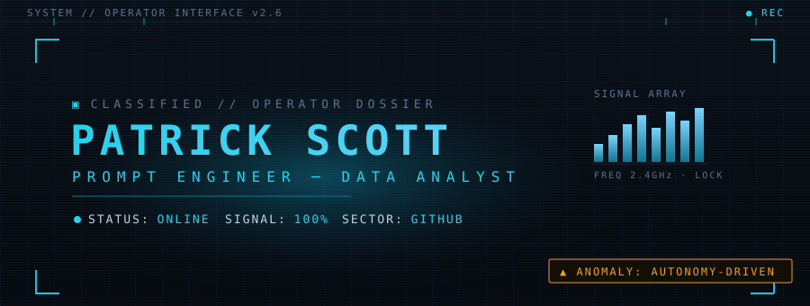

<!-- ════════════════════════════════════════════════════════════════
  OPERATOR INTERFACE // PATRICK SCOTT
  Futuristic HUD profile README.
  Hero banner: assets/hero.svg (commit it alongside this README)
════════════════════════════════════════════════════════════════ -->

<div align="center">
  
</div>

<br>

<!-- ──────────────────────────── DOSSIER ──────────────────────────── -->
## ▣ OPERATOR DOSSIER

```
▸ OPERATOR DOSSIER ───────────────────── CLEARANCE: A-Δ
─────────────────────────────────────────────────────────
  CODENAME........  Patrick Scott
  DESIGNATION.....  Prompt Engineer & Data Analyst
  SPECIALTY.......  Data → insight · AI prompt & agent engineering
  BASE OF OPS.....  GitHub // Cloud // Terminal
  CURRENT FOCUS...  Autonomous agents · RAG · n8n automation
  STATUS..........  ● ONLINE · SIGNAL LOCKED
─────────────────────────────────────────────────────────
```

<!-- ──────────────────────────── TELEMETRY ────────────────────────── -->
## ◈ LIVE TELEMETRY

<div align="center">
  <a href="https://github.com/Patrickscott999">
    
  </a>
  &nbsp;
  <a href="https://github.com/Patrickscott999">
    
  </a>
  <br><br>
  <a href="https://github.com/Patrickscott999">
    
  </a>
  <br><br>
  <a href="https://github.com/Patrickscott999">
    
  </a>
</div>

<!-- ──────────────────────────── ARSENAL ──────────────────────────── -->
## ⬢ ARSENAL

<div align="center">

<!-- Languages -->


<br><br>
<!-- Data -->


<br><br>
<!-- AI & Automation -->


</div>

<!-- ──────────────────────────── MISSIONS ─────────────────────────── -->
## ▲ MISSION ARCHIVE

<div align="center">

<table>
  <tr>
    <td width="50%" align="left" valign="top">
      <b>▌ <a href="https://github.com/Patrickscott999/prime-agent">prime-agent</a></b><br>
      <sub>Self-improving RLM agent for coding workflows & long-running autonomous tasks.</sub><br><br>
      
      
    </td>
    <td width="50%" align="left" valign="top">
      <b>▌ <a href="https://github.com/Patrickscott999/multimodal_rag">multimodal_rag</a></b><br>
      <sub>Multimodal retrieval-augmented generation pipeline.</sub><br><br>
      
      
    </td>
  </tr>
  <tr>
    <td width="50%" align="left" valign="top">
      <b>▌ <a href="https://github.com/Patrickscott999/super_intel_AI_n8n">super_intel_AI_n8n</a></b><br>
      <sub>AI-driven intelligence workflows built on n8n.</sub><br><br>
      
      
    </td>
    <td width="50%" align="left" valign="top">
      <b>▌ <a href="https://github.com/Patrickscott999/Quantum_Canvas">Quantum_Canvas</a></b><br>
      <sub>Generative CSS / creative-coding canvas.</sub><br><br>
      
      
    </td>
  </tr>
  <tr>
    <td width="50%" align="left" valign="top">
      <b>▌ <a href="https://github.com/Patrickscott999/TikTok_Downloader">TikTok_Downloader</a></b><br>
      <sub>Python tool for fetching TikTok media.</sub><br><br>
      
      
    </td>
    <td width="50%" align="left" valign="top">
      <b>▌ <a href="https://github.com/Patrickscott999/PSG_V2">PSG_V2</a></b><br>
      <sub>Personal portfolio, mark II.</sub><br><br>
      
      
    </td>
  </tr>
</table>

</div>

<details>
<summary><b>▸ DECLASSIFIED MISSION ARCHIVE</b></summary>

<br>

**◇ ANALYST ARCHIVE** — where the operator cut their teeth on data.

- <a href="https://github.com/Patrickscott999/AI-Powered-Insights"><b>AI-Powered-Insights</b></a> · TypeScript — AI-driven analytics & insights toolkit
- <a href="https://github.com/Patrickscott999/AzureProject"><b>AzureProject</b></a> · Jupyter — Cloud data engineering on Azure
- <a href="https://github.com/Patrickscott999/Fifa_Analysis"><b>Fifa_Analysis</b></a> · Jupyter — Football player & match data analysis
- <a href="https://github.com/Patrickscott999/BreadBasket-Analysis"><b>BreadBasket-Analysis</b></a> · Jupyter — Retail / bakery transaction analysis
- <a href="https://github.com/Patrickscott999/Negro_League_-Analysis"><b>Negro_League_Analysis</b></a> · Jupyter — Historical Negro League baseball analytics
- <a href="https://github.com/Patrickscott999/Liverpool_V_Bournemont"><b>Liverpool_V_Bournemont</b></a> · Jupyter — Liverpool v Bournemouth match analysis

<br>

**◇ ACQUIRED TOOLING** — forks under study, integrated into the workflow.

- <a href="https://github.com/Patrickscott999/n8n-workflows"><b>n8n-workflows</b></a> — Plug-and-play n8n automation templates
- <a href="https://github.com/Patrickscott999/Duix-Avatar"><b>Duix-Avatar</b></a> — Open-source AI avatar / digital-human toolkit
- <a href="https://github.com/Patrickscott999/AI-Faceless-Video-Generator"><b>AI-Faceless-Video-Generator</b></a> — AI script + voice + talking-face video
- <a href="https://github.com/Patrickscott999/Pixelle-Video"><b>Pixelle-Video</b></a> — Fully automated short-video engine
- <a href="https://github.com/Patrickscott999/OBrainRot"><b>OBrainRot</b></a> — Open-source brainrot video generator from Reddit
- <a href="https://github.com/Patrickscott999/Bolt.diy"><b>Bolt.diy</b></a> — Self-hosted AI app builder

</details>

<br>

<div align="center"></div>

<!-- ──────────────────────────── COMMS ────────────────────────────── -->
## ⚡ COMMS UPLINK

<div align="center">
  <a href="https://public.tableau.com/app/profile/patrick.scott3217"></a>
  <br><br>
  <a href="mailto:Patrickscottcr7@gmail.com"></a>
  &nbsp;
  <a href="https://github.com/Patrickscott999"></a>
</div>

<br>

<!-- ──────────────────────────── FOOTER ───────────────────────────── -->
<div align="center">
  
  <br><br>
  <sub>▮ END OF TRANSMISSION · signal preserved · link rel="operator" href="/Patrickscott999"</sub>
</div>